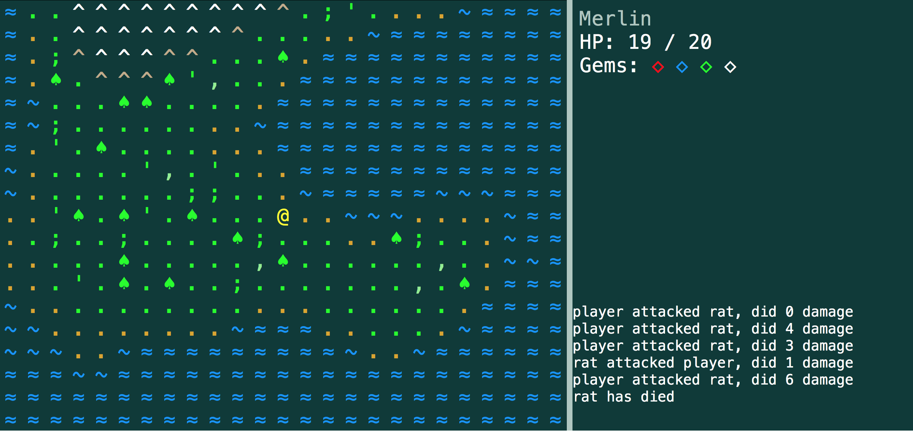

# Running the game from binaries
In order to quickly run the game, there are binaries available for OSX and Windows under this repository's [releases](https://github.com/Larkenx/LispGameJame2018/releases/tag/1.0).
To run the game from the binaries, simply download either `osx.dmg` or `windows.zip` and extract it somewhere. Open the `main` folder
in the extracted folder, and run the `main` executable. Note that the windows version of this release differs slightly in the OSX version,
where the fonts are not 1:1 match to that of the OSX executable and may have some *minor* graphical defects

# Running from source code

## Install Racket & DrRacket IDE
In order to run the game from the source code, you'll need to start by downloading and installing Racket [here](https://download.racket-lang.org/).

Once Racket is installed, you can launch DrRacket which an IDE for developing programs in Racket. 
This project relies on two third party packages that you can install directly from DrRacket.

## Install dependencies
To install the packages, you'll need to go to File > Install Package, 
then you can paste into a git URL to the package you want to install.

You will need to install two packages:
- https://github.com/jpverkamp/thing.git
- https://github.com/jpverkamp/noise.git

These packages are jpverkamp's implementation of prototype system and simplex/perlin noise. Once those packages are installed, you're ready
to run the game or hack on the repository some more. To gain a better understanding of what the code is doing, feel free to check out
jpverkamp's [wonderful tutorial](https://blog.jverkamp.com/2013/04/04/racket-roguelike-1-a-gui-screens-i/o-and-you/)
on writing a roguelike in racket, where most of my code base comes from.

## Run main.rkt
To run the game, open `src/main.rkt` in DrRacket and run the file.
